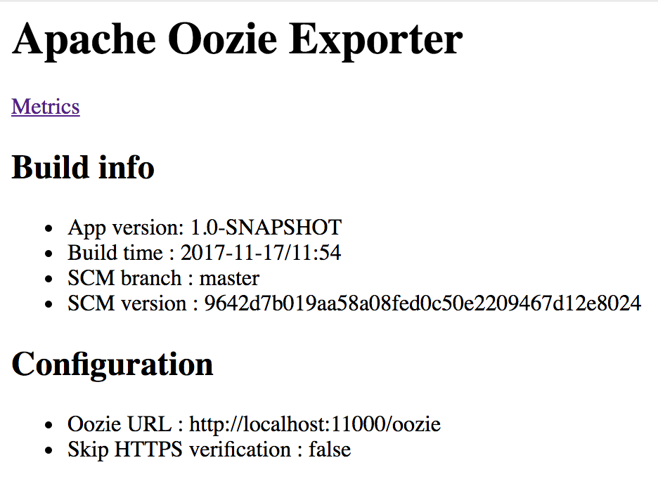

Prometheus Apache Oozie Exporter
=======

[](http://search.maven.org/#search%7Cga%7C1%7Cg%3A%22de.m3y.prometheus.exporter.oozie%22%20AND%20a%3A%22oozie-exporter%22) | [Docker Hub](https://hub.docker.com/r/marcelmay/apache-oozie-exporter/)

Exports [Apache Oozie](http://oozie.apache.org/) metrics for [Prometheus](https://prometheus.io/) including
* Oozie internal instrumentations/metrics, such as
    * database connection stats 
    * JPA stats
    * Oozie commands - such as purging - and internal queue stats
    
The exporter uses the Oozie API for fetching the metrics, and generifies/normalizes these.
As an example, the Oozie counter metrics such as `jvm.pause.info-threshold` get mapped to `oozie_counter_total{counter_group="jvm",counter_type="pause.info.threshold"}`.


Note: Oozie 4.3+ supports [exposing metrics via JMX ](https://issues.apache.org/jira/browse/OOZIE-2507), so you might want to try plain [jmx_exporter](https://github.com/prometheus/jmx_exporter) instead.

Note: If you're interested in Oozie Job Event metrics, have a look at [Oozie Prometheus Job Event Listener](https://github.com/marcelmay/oozie-prometheus-job-event-listener).

## Requirements
For building:
* JDK 8
* [Maven 3.5.x](http://maven.apache.org)
* Docker 1.6+ (only required if building docker image)

For running:
* JRE 8 for running
* Access to Oozie API via HTTP(S)
* Docker 1.6+ (only required when running docker image)

Tested Oozie versions:
* 4.2.0

## Downloading

Available on [](http://search.maven.org/#search%7Cga%7C1%7Cg%3A%22de.m3y.prometheus.exporter.oozie%22%20AND%20a%3A%22oozie-exporter%22) and as docker image on [Docker Hub](https://hub.docker.com/r/marcelmay/apache-oozie-exporter/).

## Building

```mvn clean install```

You can test the exporter using [run_example.sh](run_example.sh) after building.

For building including docker image, run:

```mvn clean install -Pdocker```

You can run the docker image via maven, too:

```mvn clean install docker:run -Pdocker```

Or directly using docker command line

```docker run -i -t -p 7772:7772 -v $PWD/src/test/resources:/fsimage-location -e "JAVA_OPTS=-server -XX:+UseG1GC -Xmx1024m" marcelmay/hadoop-hdfs-fsimage-exporter```

When running the docker image via Maven, docker will mount the projects src/test/resources directory (with test fsimage) and expose the exporter on http://0.0.0.0:7772/ .

## Installation and configuration

* Install JAR
 
* Run the exporter

  * Usage options
  
  ```
    > java -jar oozie-exporter.jar

   Usage: WebServer <OPTIONS>

   OPTIONS:
    -web.listen-address=[<hostname>:]<port>  Exporter listener address
    -oozie.url=<Oozie API Url>               Oozie API oozieApiUrl, eg http://localhost:11000/oozie
    [-oozie.user=<USER>]                     Oozie API user for authentication
    [-oozie.password=<PWD>]                  Oozie API password for authentication
    [-oozie.password.env=<ENV VAR>]          Env var containing Oozie API password for authentication
    [-skipHttpsVerification]                 Skip SSL/TLS verification for Oozie HTTPS URL

  ```
  
  * Run exporter
  ```
  > java -server \
         -jar oozie-exporter.jar \
         -web.listen-address=localhost:7772 \
         -oozie.url=http://localhost:11000/oozie
  ```
  
* Test the exporter  
  Open ```http://\<hostname>:\<port>/metrics``` or ```http://\<hostname>:\<port>/``` (for configuration overview)
   
* Add to prometheus
  ```
  - job_name: 'oozie_exporter'
      scrape_interval: 15s
      static_configs:
        - targets: ['<oozie exporter hostname>:<oozie exporter port>']
          labels:
            ...
  ```

## Example output

### Example home output



### Example metrics
Here's the example output from a standalone default Oozie:

```
TODO
```

## License

This Apache Oozie Exporter is released under the [Apache 2.0 license](LICENSE).

```
Copyright 2017 Marcel May  

Licensed under the Apache License, Version 2.0 (the "License");
you may not use this file except in compliance with the License.
You may obtain a copy of the License at

http://www.apache.org/licenses/LICENSE-2.0

Unless required by applicable law or agreed to in writing, software
distributed under the License is distributed on an "AS IS" BASIS,
WITHOUT WARRANTIES OR CONDITIONS OF ANY KIND, either express or implied.
See the License for the specific language governing permissions and
limitations under the License.
```
